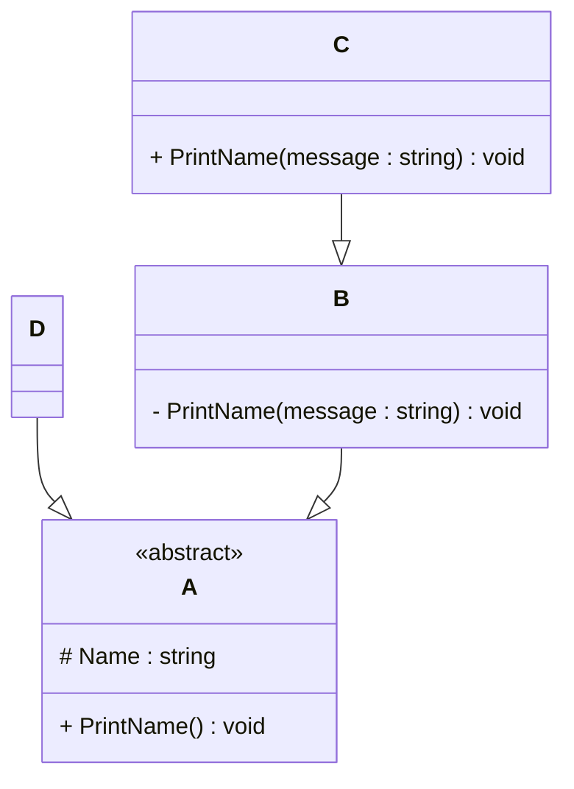

# Programming Test

This test was composed to create a general overview of your knowledge regarding general programming and how it fits with the needs in our lab. Please try to answer all questions using your own knowledge and in your own words. If you get stuck on one of the exercises, still try to give a short answer.

#I chose Python to solve the exercises.
---

## Exercise 1

### Task
Write a program in the language of your choice where:

1. The iteration number (starting from 1), followed by a random number between 1 and 100, is printed 100 times.
2. After every 5 iterations, write an additional separator (e.g., `---`).
3. Write “Lucky number!” after every random number that is divisible by 7.

> Try to keep the procedure as short as possible.

#Solution

	import random
 
	for i  in range(1, 101):                                     #for loop that iterates from 1 to 100
    	a = random.randint(1, 101)                           # generates a random number between 1 and 100
     
    	if a%7 == 0: print(i, a, "Lucky number!")            # if the random number is divisible by 7, it prints the number and "Lucky number!"
    	else: print(i, a)                                    # otherwise, it just prints the number
    	if i%5 == 0: print("---")                            # prints a separator every 5 iterations
---

## Exercise 2

### 1. **What is your understanding of the term “Design Patterns”?**  
   Provide a description in your own words.

### 2. **Explain the MVC Pattern**  
   - What does MVC stand for?  
   - Explain the pattern in detail.  
   - What are some use cases for this framework?

### 3. **List three other design patterns**  
   - Provide names and details for three additional design patterns.
   - Explain how you have used those patterns in the past and how they have solved your problem  
   - Use diagrams to explain the design patterns.

#Solution

1. "Design patterns" are general solutions for simillar problems in software engeneering. They also are optimised and effecient. The usage of design patterns helps to make colloboration between dvelopers easier.

   
2. MCV stands for Model-View-Controller

   Model stores the data, logic and commands. View represents the user interface, it displays data from the model to the user and sends users commands to the controller. Controller recieves commands from the view and changes the model.

   MCV is used in web-applications (for example Django), desk-top apps and IOS mobile apps.

3.
Singleton

     +---------------------+
     |     Singleton       |
     |---------------------|
     | - instance          |
     |---------------------|
     | + getInstance()     |
     +---------------------+

  The purpose of the Singleton pattern is to insure that class and only one access and provides an access to it. It is commonly used in configuration settings and data-base connections.

Observer 

	+-------------+       +-------------+
 	|  Subject    |<----->|  Observer 1 |
 	|-------------|       +-------------+
 	| +attach()   |       +-------------+
 	| +detach()   |       |  Observer 2 |
 	| +notify()   |       +-------------+
 	+-------------+

The main concept of the Observer pattern is that a subject notifies observers when the state changes. An observer pattern is used in event systems and user interface frameworks.

Factory

 	+-------------+       +--------------+
 	|  Factory    | --->  | Product A    |
 	|-------------|       +--------------+
 	| +create()   |       | Product B    |
 	+-------------+       +--------------+

The purpose of the Factory pattern is to create objects without specifying the exact class of it. It is commonly used in plugin systems and games.

---

## Exercise 3

### 1. **Implementation Task**  
   Based on the class diagram below, provide an implementation in any object-oriented programming language of your choice.
   

### 2. **Key Questions**  
   - Are you able to directly create a new instance of `ObjectA`? Please explain your answer.  
   - Given an instance of `ObjectC`, are you able to call the method `PrintMessage` defined in `ObjectB`? Please explain your answer.  
   - Try to explain as many key features of object-oriented programming as you can find in this example.

#Solution

1.

	from abc import ABC, abstractmethod                      

	class A(ABC):                                                # Abstract base class A
    	def __init__(self, name: str):                       # Constructor that initializes the name attribute
        	self._name = name                                 

    	@abstractmethod                                   
    	def print_name(self):                                # Abstract method that must be implemented by subclasses
        	pass

	class B(A):                                                  # Subclass B that inherits from A
    	def __init__(self, name: str):                       # Constructor that initializes the name attribute
        	super().__init__(name)          

    	def __print_name(self, message: str):                # Private method that prints a message and the name attribute
        	print(message, self._name)  

    	def _call_print_name(self, message: str):            # Method that calls the private method __print_name
        	self.__print_name(message)                    

	class C(B):                                                  # Subclass C that inherits from B
    	def __init__(self, name: str):                       # Constructor that initializes the name attribute
        	super().__init__(name)          

    	def print_name(self, message: str):                  # Method that calls the _call_print_name method from class B
        	self._call_print_name(message)      

	class D(A):                                                  # Subclass D that inherits from A
    	def __init__(self, name: str):                       # Constructor that initializes the name attribute
        	super().__init__(name)          

    	def print_name(self):                                # Method that prints the name attribute
        	print(self._name)

2.

Are you able to directly create a new instance of ObjectA? Please explain your answer.

No, it is impossible to directly create a new instance of objectA because it is defined as an abstract class. To create a new instance we need to create a subclass and implement all abstract methods.

Given an instance of ObjectC, are you able to call the method PrintMessage defined in ObjectB? Please explain your answer.

No, it is impossible because it is a private method. However we can do it indirectly using "_call_print_name()", which is public.

Try to explain as many key features of object-oriented programming as you can find in this example.

1) Abstraction
   
   Class "A" is an abstract class with an abstract method "print_name()", it hides implementation.
   
2) Encapsulation

   Attributes and methods have accsess levels (public, private or protected).
   For example: method "__print_name" is private.

3) Inheritance

   "B", "C", "D" inherit from "A" copying its structure and interface.

4) Polymorphism

   Method "print_name()" behaves differently in "C" and "D" which allows polymorthic behaviour.

5) Method overriding

   Class "D" overrides method "print_name()" from class "A".

6) Mothod overloading

   Class "C" defines a method "print_name(message)" while class "A" already has method "print_name()". This simulates overloading.

7) Objects

   Function "print_name()" is an example of an object.
   
   An object is a self-contained unit that cambines data and behaviour.

9) Classes

   For example, "A".
   
   Classes are data structures that are used to describe different types of objects.

11) Constructors

    Method "__init__(self, name: str)" is a constructor.
    
   Constructores are used for overloading, which means that multiple objects can be used with the same name.

   
---

## Exercise 4

### Maintaining and Expanding Software for Component Validation

This exercise focuses on strategies for working with existing code bases and ensuring the software remains maintainable as new features and requirements are introduced.

### 1. **Working with Existing Code**  
- How would you approach understanding and contributing to an existing code base with minimal disruption?  
- What practices would you follow to ensure your changes integrate well with the current structure?  

### 2. **Ensuring Maintainability**  
- What techniques would you use to keep the code base clean, modular, and easy to maintain as new features are added?  
- How would you handle code documentation and testing to support long-term maintainability?  

### 3. **Balancing Flexibility and Stability**  
- How would you design or refactor the software to make it flexible for future changes while ensuring the existing functionality remains stable?  
- Which design patterns or principles would you apply to achieve this balance

#Solution

1.

- In order to approch understanding and contribute to an existeing code with minimal disruption I would firstly look at the code and read its documentation. Then I would ask some questions about it to the team and go to the parts that need improvement. Then I will run only the parts that I will work with and make all the corrections in the copy of the file. After it I will sugest my improvements to the team and apply them if they appove them.
- I will copy the existing style, name and architecture. Also, I will try to avoid global corrections and try to make everything as local as possible. Moreover, I would ask the teammembers to approve my code in order to avoid mistakes.

2.
- I would use "single responsebility technique" - one reason for a change before test run and "open/closed technique" - code is open forextensions but closed for modifications. I will also leave comments for the teammembers to explain what I do.
- I believe that Dogstring and API-Documentation are the best way to keep-up with documentation. It is automated and easy in use. Also in-line comments are a good idea for a long-term meintainability.

3.
- I would use desing patterns in order to allow new logic without modifying core classes. Also I would use Dependency injection to make modules easier to to test and swap out. Interface segregation can also be helpful in this context because small nterfaces prevent bloated classes.
- I believe that "DRY" (do not repeate yourself) is the best principle to achieve this balance. It tells us to avoid duplicated logic. Also "KISS" (keep it simple, stupid) and "YAGNI" (you aren't gonna need it) make any code easier to debug and help other developers when they read yout code. Speaking about patterns, I beleive that obserer pattern will help in context of event-driven updates and adapter pattern will be useful for compability between new and existing components.

---
